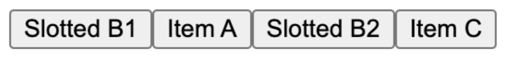
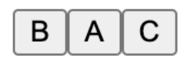

# CSS reading-order-items Explainer

Author: Di Zhang

Last updated: June 5, 2024

Issue: TBD

## Introduction to the problem

Focus navigation is the mechanism that allows users to navigate and access the contents of a website using their keyboard. Currently, this navigation follows the source order, aka the order the elements are defined in the DOM tree. This causes a disconnect when the elements are displayed in a different order, using a flexbox or grid layout, where the visual reading order can be different from the underlying source order using features like the `order` property.

The CSS Working Group proposed to solve this problem using the [new CSS property reading-order-items](https://drafts.csswg.org/css-display-4/#propdef-reading-order). This property allows developers to specify how items within a flex or grid container should be read. In this explainer, we are proposing changes to the WHATWG specifications to support this new property for sequential focus navigation. Namely, we propose adding a new focus scope owner and more steps to the sequential navigation search algorithm.

Note this feature will become even more valuable in the upcoming CSS Masonry, which uses an automatic layout method in which items are displayed in a harder-to-predict order.

## New specifications in WHATWG

### Definitions

A **reading order container** is either

- a flex container that has the CSS property `reading-order-items` set to `flex-visual` or `flex-flow`.
- a grid container that has the CSS property `reading-order-items` set to `grid-rows`, `grid-columns` or `grid-order`.

A **reading order item** is a flex item or grid item whose layout parent is a reading order container.

### New Focus Navigation Scope Owner

The definition of [focus navigation scope owner](https://html.spec.whatwg.org/multipage/interaction.html#tabindex-ordered-focus-navigation-scope) should be modified:

_A node is a focus navigation scope owner if it is a Document, a shadow host, a slot, an element in the popover showing state which also has a popover invoker set, or a **reading order container**._

Add this to the [associated focus navigation owner](https://html.spec.whatwg.org/multipage/interaction.html#associated-focus-navigation-owner) algorithm, after existing step 2 and before the existing step 3:

_2.5. If element’s layout parent is a reading order container, then return the reading order container element._

### Changes to `sequential navigation search algorithm`

[https://html.spec.whatwg.org/multipage/interaction.html#sequential-navigation-search-algorithm](https://html.spec.whatwg.org/multipage/interaction.html#sequential-navigation-search-algorithm)

Add new steps after existing step 1 and before the existing step 2:

1.5. If _candidate_ is a **reading order item** or null, _direction_ is "forward", and _starting point_ is in a **reading-ordered focus navigation scope** _scope_, then let _new candidate_ be the result of the **reading order sequential navigation search algorithm** with _candidate_, _direction_ and _scope_.

If _starting point_ is a **reading order item**, _direction_ is "backward", and _starting point_ is in a **reading-ordered focus navigation scope** _scope_, then let the _new candidate_ be the result of the **reading order sequential navigation search algorithm** with _starting point_, _direction_ and _starting point_’s focus navigation _scope_.

If _new candidate_ is null, then let _starting point_ be _candidate_, and return to step 1 of this algorithm. Otherwise, let _candidate_ be _new candidate_.

#### reading order sequential navigation search algorithm

To **find the next item in reading order**, given a reading order item _current_, a direction _direction_ and a reading ordered focus navigation scope _scope_, perform the following steps. They return an Element.

1. Let _reading order items_ be the list of reading order items owned by _scope_, sorted in **reading order**.
2. If _reading order items_ is empty, return null.
3. If _direction_ is “forward”, then:
   1. Let _previous_ be the reading order item that comes before _current_, in DOM tree order.
   2. If _previous_ is null, return the first item in _reading order items_.
   3. Otherwise, if _previous_ is the last item in _readinging order items_, return null.
   4. Otherwise, return the item that comes after _previous_ in \_reading order items.
4. Otherwise:
   1. Let _previous_ be the item that comes before _current_ in _reading order items_.
   2. If _previous_ is null, return null.
   3. Otherwise, if _previous_ does not have any DOM tree descendants, return _previous_.
   4. Otherwise, return the last DOM tree descendant of _previous_.

### Changes to `tabindex-ordered focus navigation scope`

[https://html.spec.whatwg.org/multipage/interaction.html#tabindex-ordered-focus-navigation-scope](https://html.spec.whatwg.org/multipage/interaction.html#tabindex-ordered-focus-navigation-scope)

Change

The order within a [tabindex-ordered focus navigation scope](https://html.spec.whatwg.org/multipage/interaction.html#tabindex-ordered-focus-navigation-scope) is determined by each element's [tabindex value](https://html.spec.whatwg.org/multipage/interaction.html#tabindex-value), as described in the section below.

to

The order within a [tabindex-ordered focus navigation scope](https://html.spec.whatwg.org/multipage/interaction.html#tabindex-ordered-focus-navigation-scope) is determined by each element's [tabindex value](https://html.spec.whatwg.org/multipage/interaction.html#tabindex-value) and, for reading-ordered focus navigation scopes, by the special rules provided by the **sequential navigation search algorithm**. Note: tabindex takes precedence over **reading order**.

### Add new section 6.6.N The Reading Order

A **reading-ordered focus navigation scope** is a [tabindex-ordered focus navigation scope](https://html.spec.whatwg.org/multipage/interaction.html#tabindex-ordered-focus-navigation-scope) where the scope owner is a reading order container.

The **reading order** for a **reading-ordered focus navigation scope** is determined by the container’s [reading-order-items](https://drafts.csswg.org/css-display-4/#propdef-reading-order-items) value:

- For `flex-visual`: the reading order should be defined by the flex items, sorted in the visual reading order and taking the writing mode into account.
- For `flex-flow`: the reading order should be defined by the flex items, sorted by the CSS ‘flex-flow’ direction.
- For `grid-rows`: the reading order should be defined by the grid items, sorted first by their displayed row order, and then by their column order, taking the writing mode into account.
- For `grid-columns`: the reading order should be defined by the grid items, sorted first by their displayed column order, and then by their row order, taking the writing mode into account.
- For `grid-order`: the reading order should follow the [order-modified document order](https://drafts.csswg.org/css-display-4/#order-modified-document-order).

## Examples

### Example - `grid-order`

```HTML
<!DOCTYPE html>
<style>
.wrapper {
  display: grid;
  reading-order-items: grid-order;
}
</style>
<div class="wrapper">
 <button id="a" style="order: 2">A</button>
 <button id="b" style="order: 4">B</button>
 <button id="c" style="order: 3">C</button>
 <button id="d" style="order: 1">D</button>
</div>
```


Follows the order-modified document order, unless the order property has been used to change the order of items.

**Forward navigation**

Current is null or outside the scope

1. Find first element in scope.
2. Find first element in Reading order.
3. Return D

Current is D

1. Find next DOM from D: null since outside the scope.
2. Find previous. Since next DOM is null, this is last element D.
3. Move forward from D in reading order.
4. Return A.

Current is A → Return C

Current is C → Return B

Current is B

1. Find next DOM from B, aka C.
2. Find previous from C, aka B.
3. Move forward from B in reading order.
4. Return null.

**Backward navigation**

Current is null or outside the scope

1. Find last element in scope.
2. Find last element in Reading order.
3. Return B

Current is B

1. B is a reading order item.
2. previous is C.
3. Iterate in DOM tree order until next reading item after C, aka D.
4. Return DOM element before D, aka C.

Current is C → Return A

Current is A → Return D

Current is D

1. D is a reading order item.
2. previous is null.
3. Return null as we are already at last item to visit.

### Example - `grid-order` with nested children

```HTML
<!DOCTYPE html>
<style>
.wrapper {
 display: grid;
 reading-order-items: grid-order;
}
</style>
<div class="wrapper">
 <div id="A" style="order: 2">A
   <button id="a" style="order: 3">a</button>
 </div>
 <div id="B" style="order: 3">B
   <button id="b">b</button>
 </div>
 <div id="C" style="order: 1">C
   <button id="c">c</button>
 </div>
</div>
```


**Forward navigation**

Current is null or outside the scope

1. Find first element in scope.
2. Find first element in Reading order.
3. Return C

Current is C

1. Find next DOM from C, aka c.
2. Since c is not a reading order item nor is it null, return c.

Current is button c

1. Find next DOM from c, aka null.
2. Find previous. Since next DOM is null, this is C.
3. Move forward from C in reading order.
4. Return A.

Current A → Return a.

Current a → Return B.

Current B → Return b.

Current is b

1. Find next DOM from b, aka null.
2. Find previous. Since next DOM is null, this is B.
3. Move forward from B in reading order.
4. Return null.

**Backward navigation**

Current is null or outside the scope

1. Find last element in scope.
2. Find last element in Reading order, B
3. Find last child element within it, return b

Current is b

1. b is not a reading order item
2. Reading the previous DOM order element, B

Current is B

1. B is a reading order item.
2. previous is A.
3. Iterate in DOM tree order until next reading item after A, aka B.
4. Return DOM element before B, aka a.

Current is a → Return A

Current is A → Return c

Current is c → Return C

Current is C

1. C is a reading order item.
2. previous is null.
3. Return null as we are already at last item to visit.

## Open Questions

#### What should be the reading order if reading order items are defined through display: contents and cross different scopes?

```HTML
<!DOCTYPE html>
<meta charset="utf-8">

<div>
<template shadowrootmode="open" shadowrootdelegatesfocus>
<style>
.wrapper {
  display: flex;
  reading-order-items: flex-visual;
}
</style>
<div class=wrapper>
<button id="A" style="order: 2">Item A</button>
<slot></slot>
<button id="C" style="order: 4">Item C</button>
</div>
</template>

<button id="B1" style="order: 1">Slotted B1</button>
<button id="B2" style="order: 3">Slotted B2</button>
</div>
```

Render:



Source order: A,B1,B2,C

Reading order: B1,A,B2,C

Given the [flattened tabindex-ordered focus navigation ](https://html.spec.whatwg.org/multipage/interaction.html#flattened-tabindex-ordered-focus-navigation-scope)scope, step 2.2, we should visit all elements within a scope together (so B1, then B2). However, that is visually the wrong order.

#### What should be the reading order if a reading order item is a display: contents scope owner?

```HTML
<!DOCTYPE html>
<meta charset="utf-8">

<style>
 .wrapper {
   display: flex;
   reading-order-items: flex-visual;
 }
 </style>
<div class=wrapper id="root">
 <div style="display: contents">
   <template shadowrootmode=open>
     <slot></slot>
   </template>
   <button id="A2" style="order: 2">A</button>
   <button id="B2" style="order: 1">B</button>
 </div>
 <button id="C" style="order: 3">C</button>
</div>
```

Render:



Source order: A,B,C

Reading order: B,A,C

In this case, we have a DIV that is:

- A Shadow host (so a focus navigation scope owner)
- Its layout parent is a reading order container
- Has display: contents

Should the DIV qualify as a reading order item? If so, it can be included in the defined **reading-ordered focus navigation scope**, but there isn’t a straightforward way to include it in the reading order, since it isn’t part of the reading order container, and isn’t displayed on its own. So it’s unclear where it belongs with respect to the other reading order items. Perhaps the best option is to say that `display:contents` items inside **reading order container**s are not focusable.

## List of relevant issues

[csswg-drafts issue 9230](https://github.com/w3c/csswg-drafts/issues/9230) Define how reading-order / reading-order-items interact with focusable display: contents elements.

[csswg-drafts issue 7387](https://github.com/w3c/csswg-drafts/issues/7387) Providing authors with a method of opting into following the visual order, rather than logical order

[csswg-drafts issue 9921](https://github.com/w3c/csswg-drafts/issues/9921) Is reading-order-items the best name for this property?

[csswg-drafts issue 9922](https://github.com/w3c/csswg-drafts/issues/9922) Should the reading-order-items property apply to tables in addition to flex and grid layouts?

[csswg-drafts issue 9923](https://github.com/w3c/csswg-drafts/issues/9923) Proposed alternative syntax for reading order

[csswg-drafts issue 8589](https://github.com/w3c/csswg-drafts/issues/8589) Do we need reading-order: &lt;integer> or should reading-order: auto be allowable in all grid or flex layouts?

[csswg-drafts issue 8257](https://github.com/w3c/csswg-drafts/pull/8257) Define 'reading-order: auto'
