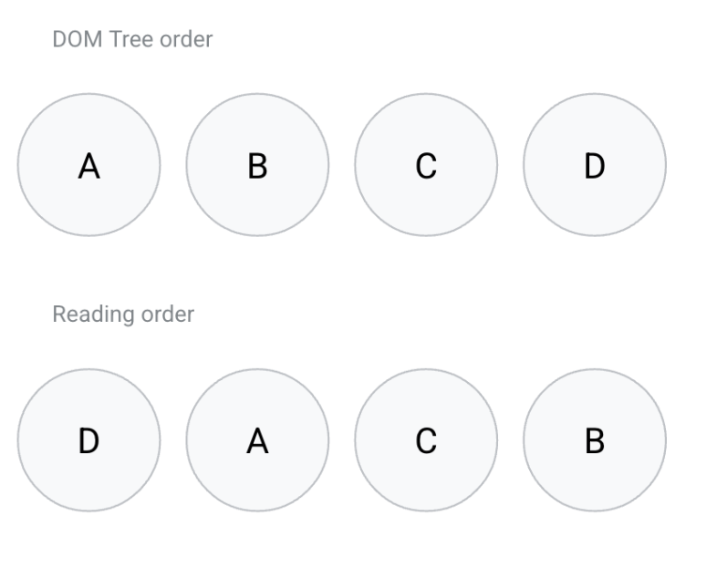
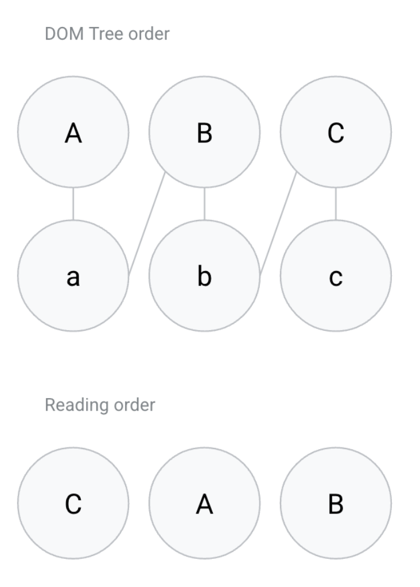
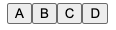
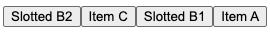
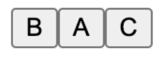

# CSS reading-flow Explainer

Authors: Di Zhang, Mason Freed

Last updated: October 25, 2024

Issue: https://github.com/whatwg/html/issues/10407

## Introduction to the problem

Focus navigation is the mechanism that allows users to navigate and access the contents of a website using their keyboard. Currently, this navigation follows the source order, aka the order the elements are defined in the DOM tree. This causes a disconnect when the elements are displayed in a different order, using a flexbox or grid layout, where the visual reading flow can be different from the underlying source order using features like the `order` property.

The CSS Working Group resolved to solve this problem using the [new CSS property reading-flow](https://drafts.csswg.org/css-display-4/#reading-flow). This property allows developers to specify how items within a flex or grid container should be read. In this explainer, we are proposing changes to the WHATWG specifications to support this new property for sequential focus navigation. Namely, we propose adding a new focus scope owner and more steps to the sequential navigation search algorithm.

Note this feature will become even more valuable in the upcoming CSS Masonry, which uses an automatic layout method in which items are displayed in a harder-to-predict order.

## New specifications in WHATWG

### Definitions

A **reading flow container** is either:

- a flex container that has the CSS property `reading-flow` set to `flex-visual` or `flex-flow`.
- a grid container that has the CSS property `reading-flow` set to `grid-rows`, `grid-columns` or `grid-order`.

A **reading flow container scope owner** is either:

- a **reading flow container**.
- a `display: contents` element whose box tree parent is a **reading flow container**.

A **reading flow item** is an element whose parent is a **reading flow container scope owner**.

A **non participating reading flow item** is a **reading flow item** whose computed value of the 'display' property is 'contents' or whose computed value of the 'position' property is 'fixed' or 'absolute'.

### New Focus Navigation Scope Owner

The definition of [focus navigation scope owner](https://html.spec.whatwg.org/multipage/interaction.html#tabindex-ordered-focus-navigation-scope) should be modified:

_A node is a focus navigation scope owner if it is a Document, a shadow host, a slot, an element in the popover showing state which also has a popover invoker set, a **reading flow container scope owner** or a **reading flow item**._

Add this to the [associated focus navigation owner](https://html.spec.whatwg.org/multipage/interaction.html#associated-focus-navigation-owner) algorithm, after existing step 5 and before the existing step 6:

_6. If element’s parent is a reading flow container scope owner or a reading flow item, then return the parent._

### Changes to `sequential navigation search algorithm`

[https://html.spec.whatwg.org/multipage/interaction.html#sequential-navigation-search-algorithm](https://html.spec.whatwg.org/multipage/interaction.html#sequential-navigation-search-algorithm)

Add new steps inside existing step 2, after point 2.1:

2.1.5. If _starting point_ is in a **reading-flow container focus navigation scope** _scope_, then let _candidate_ be the result of the **reading-flow container sequential navigation search algorithm** with _starting point_, _direction_ and _scope_.

#### reading-flow container sequential navigation search algorithm

To **find the next item in reading flow**, given a reading flow item _current_, a direction _direction_ and a reading-flow container focus navigation scope _scope_, perform the following steps. They return an Element.

1. Let _reading flow items_ be the list of reading flow items owned by _scope_, sorted in **reading flow**.
2. If _direction_ is “forward”, then return the item that comes after _current_ in _reading flow items_.
3. Otherwise, return the item that comes before _current_ in _reading flow items_.

### Changes to `tabindex-ordered focus navigation scope`

[https://html.spec.whatwg.org/multipage/interaction.html#tabindex-ordered-focus-navigation-scope](https://html.spec.whatwg.org/multipage/interaction.html#tabindex-ordered-focus-navigation-scope)

Change definition:

A **tabindex-ordered focus navigation scope** is a list of focusable areas and focus navigation scope owners, whose contents are determined as follow:

- It contains all elements in owner's focus navigation scope that are themselves focus navigation scope owners, except the elements whose tabindex value is a negative integer.

- It contains all of the focusable areas whose DOM anchor is an element in owner's focus navigation scope, except the focusable areas whose tabindex value is a negative integer.

Every focus navigation scope owner owner has either a **tabindex-ordered focus navigation scope** or a **reading-flow container focus navigation scope**.

The order within a [tabindex-ordered focus navigation scope](https://html.spec.whatwg.org/multipage/interaction.html#tabindex-ordered-focus-navigation-scope) is determined by each element's [tabindex value](https://html.spec.whatwg.org/multipage/interaction.html#tabindex-value) and, the order within a [reading-flow container focus navigation scope](TBD) is determined by the scope owner's [reading flow value](TBD).

Change definition **flattened tabindex-ordered focus navigation scope** to **flattened focus navigation scope**:

A flattened focus navigation scope is a list of focusable areas. Every focus navigation scope owner _owner_ owns a distinct flattened focus navigation scope, whose contents are determined by the following algorithm:

1. Let result be a clone of owner's tabindex-ordered focus navigation scope or reading-flow container focus navigation scope.
2. For each item of result:
   1. If item is not a focus navigation scope owner, then continue.
   2. If item is not a focusable area, then replace item with all of the items in item's flattened focus navigation scope.
   3. Otherwise, insert the contents of item's flattened focus navigation scope after item.

TODO(dizhangg): Change reference to all these scopes as well in the spec.

### Add new section 6.6.4 The reading flow

Add this new section after existing section [6.6.3 The tabindex attribute](https://html.spec.whatwg.org/multipage/interaction.html#the-tabindex-attribute):

A **reading-flow container focus navigation scope** is a [focus navigation scope](https://html.spec.whatwg.org/multipage/interaction.html#focus-navigation-scope) where the scope owner is a **reading flow container scope owner**.

The **reading flow** for a **reading-flow container focus navigation scope** is determined by the scope owner's [CSS reading-flow](https://drafts.csswg.org/css-display-4/#propdef-reading-flow) value:

- For `flex-visual`: the reading flow should be defined by the flex items, sorted in the visual reading flow and taking the writing mode into account, followed by **non participating reading flow items**.
- For `flex-flow`: the reading flow should be defined by the flex items, sorted by the CSS ‘flex-flow’ direction, followed by **non participating reading flow items**.
- For `grid-rows`: the reading flow should be defined by the grid items, sorted first by their displayed row order, and then by their column order, taking the writing mode into account, followed by **non participating reading flow items**.
- For `grid-columns`: the reading flow should be defined by the grid items, sorted first by their displayed column order, and then by their row order, taking the writing mode into account, followed by **non participating reading flow items**.
- For `grid-order`: the reading flow should follow the [order-modified document order](https://drafts.csswg.org/css-display-4/#order-modified-document-order), followed by **non participating reading flow items**.

## Examples

NOTE: These examples might be outdated.

In the following examples, we use the new **reading flow sequential navigation search algorithm** to find the next reading flow item to navigate to.

### Example - `grid-order`

```HTML
<!DOCTYPE html>
<style>
.wrapper {
  display: grid;
  reading-flow: grid-order;
}
</style>
<div class="wrapper">
 <button id="a" style="order: 2">A</button>
 <button id="b" style="order: 4">B</button>
 <button id="c" style="order: 3">C</button>
 <button id="d" style="order: 1">D</button>
</div>
```



**Forward navigation**

Start at the first element in the reading-flow container focus navigation scope:

1. Find first element in reading flow items, D.
2. Return D

Given _starting point_ D, _candidate_ null and _direction_ forward:

1. _current_ is null.
2. _previous_ is last item in DOM tree order, D.
3. Move forward from D in reading flow.
4. Return A.

...

Given _starting point_ B, _candidate_ C and _direction_ forward:

1. _current_ is C.
2. _previous_ is B.
3. Move forward from B in reading flow.
4. Return null.

**Backward navigation**

End at the last element in the reading-flow container focus navigation scope:

1. Find last element in reading flow items, B.
2. Return B

Given _starting point_ B and _direction_ backward:

1. _current_ is B.
2. _previous_ is C, it has no descendants.
3. Return C.

...

Given _starting point_ D and _direction_ backward:

1. _current_ is D.
2. _previous_ is null.
3. Return null.

### Example - `grid-order` with nested children

```HTML
<!DOCTYPE html>
<style>
.wrapper {
 display: grid;
 reading-flow: grid-order;
}
</style>
<div class="wrapper">
 <div id="A" style="order: 2">A
   <button id="a" style="order: 3">a</button>
 </div>
 <div id="B" style="order: 3">B
   <button id="b">b</button>
 </div>
 <div id="C" style="order: 1">C
   <button id="c">c</button>
 </div>
</div>
```



**Forward navigation**

Start at the first element in the reading-flow container focus navigation scope:

1. Find first element in reading flow items, C.
2. Return C.

Given _starting point_ C, _candidate_ c and _direction_ forward:

1. Not in reading flow sequential navigation since c is not a reading flow item.
2. Return c.

Given _starting point_ c, _candidate_ null and _direction_ forward:

1. _current_ is null.
2. _previous_ is last item in DOM tree order, C.
3. Move forward from C in reading flow.
4. Return A.

...

Given _starting point_ b, _candidate_ C and _direction_ forward:

1. _current_ is C.
2. _previous_ is B.
3. Move forward from B in reading flow.
4. Return null.

**Backward navigation**

End at the last element in the reading-flow container focus navigation scope:

1. Find last element in reading flow, B.
2. Find last descendant within it, b
3. Return b.

Given _starting point_ b and _direction_ backward:

1. Not in reading flow sequential navigation since b is not a reading flow item.
2. Return B.

Given _starting point_ B and _direction_ backward:

1. _current_ is B.
2. _previous_ is A, it has descendant a.
3. Return a.

...

Given _starting point_ C and _direction_ backward:

1. _current_ is C.
2. _previous_ is null.
3. Return null.

### Example - `flex-visual` with focusable `display: contents`

```HTML
<!DOCTYPE html>
<meta charset="utf-8">

<style>
.wrapper {
  display: flex;
  reading-flow: flex-visual;
}
</style>

<div class="wrapper" id=wrapper>
 <div id=d1 style="display: contents" tabindex="0">
   <button style="order: 3" id="C">C</button>
   <button style="order: 1" id="A">A</button>
   <div id=d2 style="display: contents" tabindex=0>
     <button style="order: 4" id="D">D</button>
     <button style="order: 2" id="B">B</button>
   </div>
 </div>
</div>
```

Render:



Source order: C,A,D,B

In this example, we have 3 focus scopes:

- A scope where the wrapper is the owner and it follows reading flow order.
- A scope where d1 is the owner and it follows reading flow order.
- A scope where d2 is the owner and it follows reading flow order.

The focus order will be:

- wrapper, create scope
  - d1, create scope
    - A
    - C
    - d2, create scope
      - B
      - D

reading flow: d1,A,C,d2,B,D

### Example - `flex-visual` with `Shadow DOM`

```HTML
<!DOCTYPE html>
<meta charset="utf-8">

<div id="host">
<template shadowrootmode="open" shadowrootdelegatesfocus>
<style>
.wrapper {
  display: flex;
  reading-flow: flex-visual;
}
</style>
<div class=wrapper id="wrapper">
<button id="A" style="order: 4">Item A</button>
<slot id="slot"></slot>
<button id="C" style="order: 2">Item C</button>
</div>
</template>

<button id="B1" style="order: 3">Slotted B1</button>
<button id="B2" style="order: 1">Slotted B2</button>
</div>
```

Render:



Source order: A,B1,B2,C

In this example, we have 3 focus scopes:

- A scope where the shadow host is the owner and it follows DOM order.
- A scope where the wrapper is the owner and it follows reading flow order.
- A scope where the slot is the owner and it follows reading flow order.

The focus order will be:

- host, create scope
  - wrapper, create scope
    - C
    - A
    - slot, create scope
      - B2
      - B1

reading flow: C,A,B2,B1

### Example - Another `flex-visual` with `Shadow DOM`

```HTML
<!DOCTYPE html>
<meta charset="utf-8">

<style>
 .wrapper {
   display: flex;
   reading-flow: flex-visual;
 }
 </style>
<div class=wrapper id="wrapper">
 <div style="display: contents" id=host>
   <template shadowrootmode=open>
     <slot id=slot></slot>
   </template>
   <button id="A2" style="order: 2">A</button>
   <button id="B2" style="order: 1">B</button>
 </div>
 <button id="C" style="order: 3">C</button>
</div>
```

Render:



Source order: A,B,C

In this example, we have 3 focus scopes:

- A scope where wrapper is the owner and it follows reading flow order.
- A scope where host is the owner and it follows reading flow order.
- A scope where the slot is the owner and it follows reading flow order.

The focus order will be:

- wrapper, create scope
  - C
  - host, create scope
    - slot, create scope
      - B
      - A

reading flow: C,B,A

## Open questions

[reading-flow vs display: contents](./display-contents-focus-scope-owner.md)

[reading-flow vs tabindex](./reading-flow-vs-tabindex.md)

## List of relevant issues

[csswg-drafts issue 9230](https://github.com/w3c/csswg-drafts/issues/9230) Define how reading-flow interact with focusable display: contents elements.

[whatwg issue 10533](https://github.com/whatwg/html/issues/10533) Discussing how to focus navigate display: contents elements that are focusable in CSS reading-flow

[whatwg issue 10539](https://github.com/whatwg/html/issues/10539) Discussing how to focus navigate display: contents elements that are focusable in CSS reading-flow

[Chrome Feedback request Blog Post](https://developer.chrome.com/blog/reading-flow-display-contents?hl=en)

[csswg-drafts issue 9922](https://github.com/w3c/csswg-drafts/issues/9922) Should the reading-order-items property apply to tables in addition to flex and grid layouts?

[aria issue 2241](https://github.com/w3c/aria/issues/2241) Accessiblity review of CSS proposal

### Old/Resolved issues

[csswg-drafts issue 7387](https://github.com/w3c/csswg-drafts/issues/7387) Providing authors with a method of opting into following the visual order, rather than logical order

[csswg-drafts issue 9921](https://github.com/w3c/csswg-drafts/issues/9921) Is reading-order-items the best name for this property?

[csswg-drafts issue 9923](https://github.com/w3c/csswg-drafts/issues/9923) Proposed alternative syntax for reading order

[csswg-drafts issue 8589](https://github.com/w3c/csswg-drafts/issues/8589) Do we need reading-order: &lt;integer> or should reading-order: auto be allowable in all grid or flex layouts?

[csswg-drafts issue 8257](https://github.com/w3c/csswg-drafts/pull/8257) Define 'reading-order: auto'
