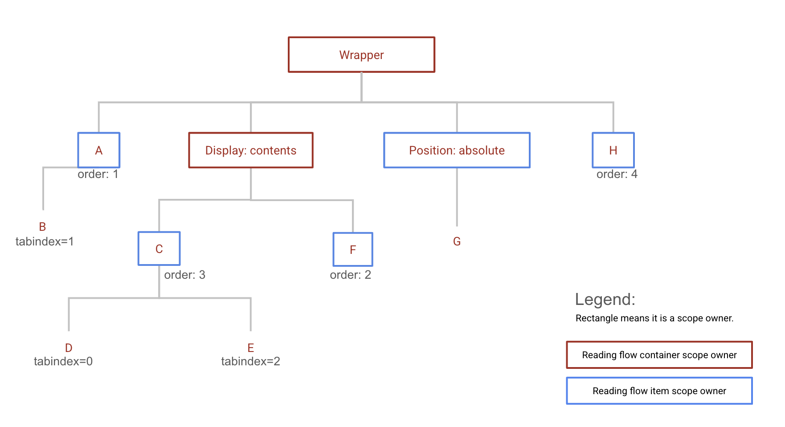
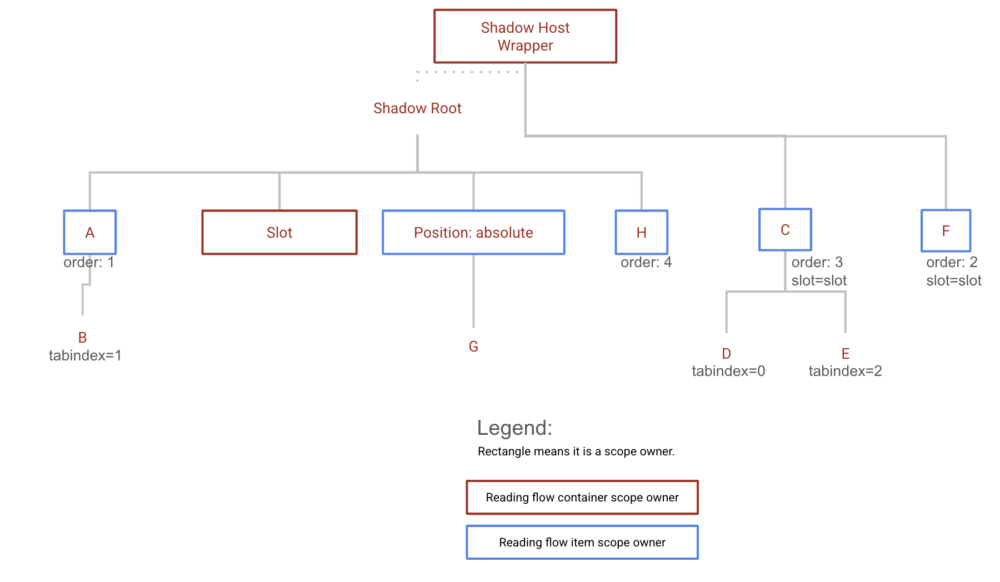

This proposal is an early design sketch by Blink DOM team to describe the problem below and solicit feedback on the proposed solution. It has not been approved to ship in Chrome.

# CSS reading-flow Explainer

Authors: Di Zhang, Mason Freed

Last updated: November 6, 2024

Issue: https://github.com/whatwg/html/issues/10407

## Introduction to the problem

Focus navigation is the mechanism that allows users to navigate and access the contents of a website using their keyboard. Currently, this navigation follows the source order, aka the order the elements are defined in the DOM tree. This causes a disconnect when the elements are displayed in a different order, using a flexbox or grid layout, where the visual reading flow can be different from the underlying source order using features like the `order` property.

The CSS Working Group resolved to solve this problem using the [new CSS property reading-flow](https://drafts.csswg.org/css-display-4/#reading-flow). This property allows developers to specify how items within a flex or grid container should be read. In this explainer, we are proposing changes to the WHATWG specifications to support this new property for sequential focus navigation. Namely, we propose adding new focus scope owners and a reading-flow-ordered focus navigation scope.

Note this feature will become even more valuable in the upcoming CSS Masonry, which uses an automatic layout method in which items are displayed in a harder-to-predict order.

## New specifications in WHATWG

### New section: 6.6.X The reading flow

The **reading-flow** value of an element is the computed value of its CSS [reading-flow](https://drafts.csswg.org/css-display-4/#reading-flow) property. If parsing fails, the property is not specified or the parsed value does not take effect, then the computed value is 'normal'.

A **reading flow container** is either:

- a flex container that has the CSS property `reading-flow` set to `flex-visual` or `flex-flow`.
- a grid container that has the CSS property `reading-flow` set to `grid-rows`, `grid-columns` or `grid-order`.

**Reading flow layout items** are the in-flow children of the layout box associated with a reading flow container.
The **reading flow layout order** of these items must be interpreted as follow:

**If the value is flex-visual**

The reading flow layout order of the items follows the order-modified document order.

**If the value is flex-flow**

The reading flow layout order of the items should be read as follow:

1. If the layout box has flex-wrap computed value equal to “wrap-reverse”, read the lines in the flex container in reverse order.
2. If the layout box has flex-direction computed value equal to “row-reverse” or “column-reverse”, read the items in each line in reverse order.

**If the value is grid-rows**

The reading flow layout order of the items should be read in row order first, then by column order.

**If the value is grid-columns**

The reading flow layout order of the items should be read in column order first, then by row order.

**If the value is grid-order**

The reading flow layout order of the items follows the [order-modified document order](https://drafts.csswg.org/css-display-4/#order-modified-document-order).

A **reading flow scope owner** is either:

- a **reading flow container**.
- a `display: contents` element whose [parent box](https://www.w3.org/TR/css-display-3/#css-parent-box) is associateed to the **reading flow container**.

A reading flow scope owner is always associated to a reading flow container, which is the closest ancestor or self element that has a layout box.

A **reading flow item** is an element whose parent is a **reading flow scope owner**.

The **reading flow order** of a _reading-flow-ordered focus navigation scope_ is the ordered list of elements constructed as follows:

1. Let output be an empty list.
2. Let container be the reading flow container associated with the reading-flow-ordered focus navigation scope owner.
3. Let items be the list of reading flow layout items in the CSS layout box of container sorted in reading flow layout order.
4. For each item in items,
   1. While item is a non-null element that is not the container:
      1. If item’s focus navigation scope owner is container and item is not in output, append item to output and break.
      2. Let item be item’s parent element.
5. For each child of container element’s children,
   1. If child’s focus navigation scope owner is container and child is not in output, append child to output.
6. Return output.

### Change to section 6.6.3 The tabindex attribute

Change:

- If the value is a zero

To list both:

- If the value is a zero
- If the value is greater than zero and the element is a reading flow item

### New Focus Navigation Scope Owner

The definition of [focus navigation scope owner](https://html.spec.whatwg.org/multipage/interaction.html#tabindex-ordered-focus-navigation-scope) should be modified:

_A node is a focus navigation scope owner if it is a Document, a shadow host, a slot, an element in the popover showing state which also has a popover invoker set, a **reading flow scope owner** or a **reading flow item**._

Add this to the [associated focus navigation owner](https://html.spec.whatwg.org/multipage/interaction.html#associated-focus-navigation-owner) algorithm, after existing step 5 and before the existing step 6:

_6. If element is a reading flow scope owner or a reading flow item, then return element._

### Changes to `sequential navigation search algorithm`

[https://html.spec.whatwg.org/multipage/interaction.html#sequential-navigation-search-algorithm](https://html.spec.whatwg.org/multipage/interaction.html#sequential-navigation-search-algorithm)

Add new steps after step 1:

2. If starting point is a reading flow item in a reading-flow-ordered focus navigation scope scope, then:
   1. Let reading flow elements be the list of elements owned by scope.
   2. If direction is “forward”, then let candidate be the element that comes after starting point in reading flow elements.
   3. Otherwise, let candidate be the element that comes before starting point in reading flow elements.

### Changes to `tabindex-ordered focus navigation scope`

Change wording:

The order of elements within a focus navigation scope does not impact any of the algorithms in this specification. Ordering only becomes important for the tabindex-ordered focus navigation scope, flattened tabindex-ordered focus navigation and reading-flow-ordered focus navigation scope concepts defined below.

Change wording:

The order within a tabindex-ordered focus navigation scope is determined by each element's tabindex value.

Add definition:

A **reading-flow-ordered focus navigation scope** is a t whose focus navigation scope owner is a reading flow scope owner. Its order is determined by the reading flow order.

## Examples

### Example - `grid-order`

```HTML
<!DOCTYPE html>
<style>
.wrapper {
  display: grid;
  reading-flow: grid-order;
}
</style>
<div class="wrapper">
 <button id="a" style="order: 2">A</button>
 <button id="b" style="order: 4">B</button>
 <button id="c" style="order: 3">C</button>
 <button id="d" style="order: 1">D</button>
</div>
```


- `wrapper` is a reading flow container.
- Its "reading flow layout items" are A, B, C, D.
- Its "reading flow layout order" is D -> A -> C -> B.
- Its "reading flow order" is D -> A -> C -> B.

### Example - `grid-order` with nested children

```HTML
<!DOCTYPE html>
<style>
.wrapper {
 display: grid;
 reading-flow: grid-order;
}
</style>
<div class="wrapper">
 <div id="A" style="order: 2">A
   <button id="a" style="order: 3">a</button>
 </div>
 <div id="B" style="order: 3">B
   <button id="b">b</button>
 </div>
 <div id="C" style="order: 1">C
   <button id="c">c</button>
 </div>
</div>
```


- `wrapper` is a reading flow container.
- Its "reading flow layout items" are A, B, C.
- Its "reading flow layout order" is C -> A -> B.
- Its "reading flow order" is C -> A -> B.
- `A`, `B`, `C` are reading flow items and scope owners and their children are visited right after.
- Focus order is C -> c -> A -> a -> B -> b.

### Example - `flex-visual` with focusable `display: contents`

```HTML
<!DOCTYPE html>
<meta charset="utf-8">

<style>
.wrapper {
  display: flex;
  reading-flow: flex-visual;
}
</style>

<div class="wrapper" id=wrapper>
 <div id=d1 style="display: contents" tabindex="0">
   <button style="order: 3" id="C">C</button>
   <button style="order: 1" id="A">A</button>
   <div id=d2 style="display: contents" tabindex=0>
     <button style="order: 4" id="D">D</button>
     <button style="order: 2" id="B">B</button>
   </div>
 </div>
</div>
```

Render:


Source order: C,A,D,B

In this example, we have 3 focus scopes:

- A scope where the wrapper is the owner and it follows reading flow order.
- A scope where d1 is the owner and it follows reading flow order.
- A scope where d2 is the owner and it follows reading flow order.

The focus order will be:

- wrapper, create scope
  - d1, create scope
    - A
    - C
    - d2, create scope
      - B
      - D

reading flow: d1,A,C,d2,B,D

### Example - `flex-visual` with `Shadow DOM`

```HTML
<!DOCTYPE html>
<meta charset="utf-8">

<div id="host">
<template shadowrootmode="open" shadowrootdelegatesfocus>
<style>
.wrapper {
  display: flex;
  reading-flow: flex-visual;
}
</style>
<div class=wrapper id="wrapper">
<button id="A" style="order: 4">Item A</button>
<slot id="slot"></slot>
<button id="C" style="order: 2">Item C</button>
</div>
</template>

<button id="B1" style="order: 3">Slotted B1</button>
<button id="B2" style="order: 1">Slotted B2</button>
</div>
```

Render:


Source order: A,B1,B2,C

In this example, we have 3 focus scopes:

- A scope where the shadow host is the owner and it follows DOM order.
- A scope where the wrapper is the owner and it follows reading flow order.
- A scope where the slot is the owner and it follows reading flow order.

The focus order will be:

- host, create scope
  - wrapper, create scope
    - C
    - A
    - slot, create scope
      - B2
      - B1

reading flow: C,A,B2,B1

### Example - Complex combine all cases



- Red boxes are reading flow container scope owners
  - `wrapper` is a reading flow container
    - Its "reading flow layout items" are A, C, F, H.
    - Its "reading flow items" are A, Display: contents, Position: absolute, H.
    - Its "reading flow layout order" is A -> Display: contents -> H -> position: absolute.
  - `Display: contents` is a reading flow container scope owner
    - Its "reading flow layout items" are A, C, F, H.
    - Its "reading flow items" are C, F.
    - Its "reading flow order" is F -> C.
- Blue boxes area reading flow item scope owners
  - `A`, `C`, `F`, `Position: absolute`, `H` are readi flow item scope owners and follow a normal tabindex-ordered focus navigation scope.
- The focus order is: Wrapper -> A -> B -> Display: contents -> F -> C -> E -> D -> H -> position: absolute -> G

### Example - Complex Shadow DOM combine all cases



Here is a Shadow DOM example, with the same focus navigation order. The wrapper is a shadow host and the display: contents div is a slot. Its content are slotted from the light DOM.
Because a slot has CSS display: contents, it will follow a reading flow container scope navigation.

- The focus order is: Shadow Host wrapper -> A -> B -> Slot -> F -> C -> E -> D -> H -> position: absolute -> G

## List of relevant issues

[csswg-drafts issue 9230](https://github.com/w3c/csswg-drafts/issues/9230) Define how reading-flow interact with focusable display: contents elements.

[whatwg issue 10533](https://github.com/whatwg/html/issues/10533) Discussing how to focus navigate display: contents elements that are focusable in CSS reading-flow

[whatwg issue 10539](https://github.com/whatwg/html/issues/10539) Discussing how to focus navigate display: contents elements that are focusable in CSS reading-flow

[whatwg issue 10642](https://github.com/whatwg/html/issues/10642) reading-flow vs tabindex

[Chrome Feedback request Blog Post](https://developer.chrome.com/blog/reading-flow-display-contents?hl=en)

[csswg-drafts issue 9922](https://github.com/w3c/csswg-drafts/issues/9922) Should the reading-order-items property apply to tables in addition to flex and grid layouts?

[aria issue 2241](https://github.com/w3c/aria/issues/2241) Accessiblity review of CSS proposal

### Old explainers

[reading-flow vs display: contents](./display-contents-focus-scope-owner.md)

[reading-flow vs tabindex](./reading-flow-vs-tabindex.md)

### Old/Resolved issues

[csswg-drafts issue 7387](https://github.com/w3c/csswg-drafts/issues/7387) Providing authors with a method of opting into following the visual order, rather than logical order

[csswg-drafts issue 9921](https://github.com/w3c/csswg-drafts/issues/9921) Is reading-order-items the best name for this property?

[csswg-drafts issue 9923](https://github.com/w3c/csswg-drafts/issues/9923) Proposed alternative syntax for reading order

[csswg-drafts issue 8589](https://github.com/w3c/csswg-drafts/issues/8589) Do we need reading-order: &lt;integer> or should reading-order: auto be allowable in all grid or flex layouts?

[csswg-drafts issue 8257](https://github.com/w3c/csswg-drafts/pull/8257) Define 'reading-order: auto'
